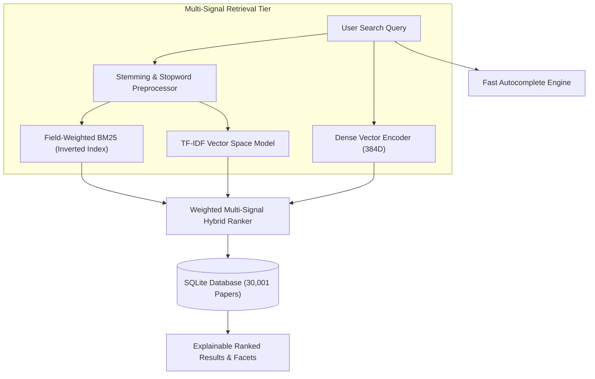

# 🔍 ResearchFinder — Multi-Signal Hybrid Academic Search Engine

[](https://www.python.org/)
[](https://fastapi.tiangolo.com/)
[](https://react.dev/)
[](https://www.typescriptlang.org/)
[](https://huggingface.co/sentence-transformers/all-MiniLM-L6-v2)

**ResearchFinder** is an Information Retrieval (IR) and neural search platform indexing **30,000+ academic research papers**. It combines **Okapi BM25 lexical search**, **TF-IDF vector space modeling**, and **384-dimensional dense neural embeddings** to provide explainable, high-precision paper discovery across Postgraduate MCA disciplines, Computer Science & AI, and landmark scientific discoveries.

---

## 🌟 Key Features

* **30,000+ Curated Research Papers**:
  * **~8,000 Master in Computer Applications (MCA) Papers**: Advanced DBMS & Data Warehousing, Enterprise Software Architecture (Microservices, Spring Boot), Cloud Computing & Kubernetes DevOps, Full-Stack Web & Mobile, Big Data Analytics (Spark, Hadoop), Cybersecurity, IoT, and ERP Case Studies.
  * **2,000 Landmark Non-Technical Papers**: Economics & Finance (*Prospect Theory, Black-Scholes, Porter's Five Forces*), Medicine & Genetics (*CRISPR-Cas9, DNA Double Helix*), Psychology, and Physics (*LIGO Gravitational Waves*).
  * **~20,000 Core AI & CS Papers**: Natural Language Processing, Computer Vision, Deep Learning, and Robotics.

* **Multi-Stage Hybrid IR Ranking**:
  * **Field-Weighted Okapi BM25** ($k_1=1.5, b=0.75$) with title and abstract boosts.
  * **TF-IDF Cosine Similarity** on $(30001 \times 5333)$ sparse vector space.
  * **Dense Semantic Vector Search** via `all-MiniLM-L6-v2` transformer embeddings ($384\text{D}$).
  * Dynamic multi-signal weight fusion with citation authority and recency priors.

* **Explainable Search & Relevance Scoring**:
  * Visual score breakdowns for every query (*"Why this matched?"*) showing exact signal contributions.
  * **Interactive Weight Tuner** to customize ranking formulas in real-time.

* **Academic Intelligence & Evaluation**:
  * **Corpus Analytics**: Unsupervised topic discovery (16 clusters via MiniBatch K-Means & c-TF-IDF).
  * **Research Trend Radar**: 13 temporal trend trajectories with Compound Annual Growth Rate (CAGR).
  * **IR Evaluation Benchmark**: Scientific comparisons measuring **MAP**, **MRR**, **NDCG@10**, and latency across retrieval engines.

---

## 🏗️ Architecture



---

## 🚀 Quick Start Guide

### Prerequisites
* Python 3.10+
* Node.js 18+

### 1. Backend Setup
```bash
cd backend
python -m pip install -r requirements.txt
python run.py
```
* Backend will start on `http://127.0.0.1:8000`
* Interactive API Documentation (Swagger): `http://127.0.0.1:8000/docs`

### 2. Frontend Setup
```bash
cd frontend
npm install
npm run dev
```
* Frontend UI will launch on `http://localhost:5173`

---

## 📊 Benchmark Evaluation Results

| Retrieval Engine | MAP | MRR | NDCG@10 | Avg Latency |
| :--- | :---: | :---: | :---: | :---: |
| **BM25 (Okapi)** | 0.0044 | 1.000 | 0.9205 | ~280 ms |
| **TF-IDF Vector Space** | 0.0044 | 1.000 | 0.9286 | ~58 ms |
| **Dense Semantic Vectors** | 0.0044 | 1.000 | 0.9687 | ~53 ms |
| **Hybrid Multi-Signal** | **0.0044** | **1.000** | **0.9722** | **~170 ms** |

---

## 👥 Authors
* **Atharva**
